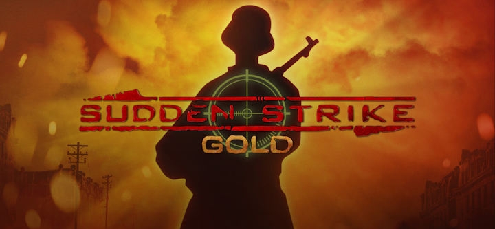
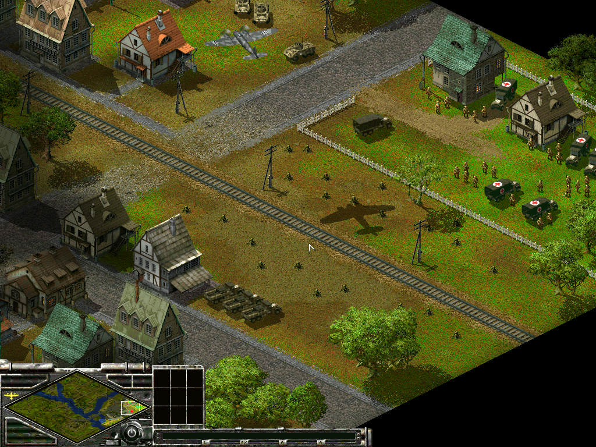

# War Action


## Project
War Action is an open source implementation of Fireglow Games' [Sudden Strike](https://en.wikipedia.org/wiki/Sudden_Strike) Gold from 2000, with the 1.2.1 patch.

## Goals
There are multiple goals this project tries to achieve:
- [x] Learn how games were made in an era when things had to be done in the code, and not through fancy game engines like today.
- [ ] Have a fully playable game implemented end-to-end, including resource management, audio, and video rendering, as well as support of large screen resolutions.
- [ ] Eventually, to support 64-bit compilation for modern systems.

## Code
```
git clone --recurse-submodules https://github.com/americusmaximus/WarAction
```

## Requirements & Dependencies
1. [Microsoft Visual Studio](https://visualstudio.microsoft.com/downloads/)
2. [OGG](https://github.com/xiph/ogg) and [Vorbis](https://github.com/xiph/vorbis)
3. [Yoink](https://github.com/americusmaximus/Yoink)
4. [ZLib](https://github.com/madler/zlib)

## Notes
1. I used GOG.com's Sudden Strike Gold 1.2.1 version [13578](https://www.google.com/search?q=setup_sudden_strike_1.21_(13578).exe) of the game.
2. The game is structured in a way where the executable is just a glue for separate menu and game modules, which are in their turn can use different renderer modules.
3. The GOG.com's version of the game uses Ogg Vorbis for the game's music. It looks like this was a recent change and a requirement for the game publishing, I believe original game shipped with mp3 files. In order to support Ogg Vorbis, the games has its own WinMM.dll library to support the file format, otherwise it is mostly a wrapper of the system library.
4. The original game used zlib version 1.1.3, which I upgraded to 1.3.1 for proper 64-bit support.
5. The original game uses RAD Game Tools' binkw32 library version 1.0Q.

## Modules

### Launcher
The launcher module is the game's executable. Its purpose is to do initial setup, read some settings, load proper renderer module, and transition control to the menu module.

### Renderer
The game ships with 3 renderer modules. The renderers have, essentially, the same codebase, the only difference is the size of the game screen supported. Available options are: 640x480, 800x600, and 1024x768.

Notes:
1. Re-engineered code contains additional conditional code using DirectDraw 7 interfaces to render the game. This is enabled on 64-bit build configuration.
2. Additionally the code contains support of 32-bit color mode, which is needed in order to run the game in windowed mode on modern systems.

### Menu
Status:
- [x] Single player. Likely to contain multiple bugs.
- [ ] Multi player. In progress, unusable...

The menu module is responsible for guiding the player through all kinds of options and activities such as starting a new campaign, loading a game, or setting up a multiplayer game. Once done - it transfers control to the game module, and the game module can transfer control back to the menu module. The game module transfers the control back as well to display statistics and transition between maps and missions.

Notes:
1. Re-engineered code contains proper support of windowed mode with correct window position tracking and mouse input handling.

### Game
Status: In Progress...

The game module is responsible for the actual gameplay, associated resource management, game state, etc, and can pass the control back to the menu module for video playback, showing mission statistics, and so on.

TODO:
- [ ] Support of windowed mode, properly track window location and offset cursor position for clicking and object selection.
- [ ] Support 32-bit color rendering in cases when the module is directly writes to the renderer surface without calling renderer functions, as in function at 0x10070f80.



## Similar & Related Projects
1. [War Storm](https://github.com/americusmaximus/WarStorm)
2. [War Motion](https://github.com/americusmaximus/WarMotion)
3. [War Tool Kit](https://github.com/americusmaximus/WarToolKit)

## Thanks
1. [Hifi](https://github.com/hifi-unmaintained/ogg-winmm) for the original implementation of WinMM.dll with the Ogg Vorbis support. Even though the game's version is very customized, access to the original code was very useful.
3. [elwray](https://github.com/elwray/N2CadX) for the initial research of the rendering modules.
4. [IvanishinV](https://github.com/IvanishinV/MultiCAD) for completing reverse engineering and re-engineering of CAD1024 renderer.

## Legal
1. This is not a complete game. Please purchase software you like!
2. The source code in this repository is mostly produced by reverse engineering the original binaries. There are a couple of exceptions for reverse engineering under DMCA -- documentation, interoperability, fair use. See goals section for the interoperability and fair use cases. The documentation is needed to support those. Also please see an article about [software preservation](https://en.wikipedia.org/wiki/Digital_preservation).
3. Sudden Strike, Fireglow Games, CDV, RAD Game Tools, Bink, Ogg Vorbis, DirectDraw, DirectX, and others are trademarks of their respective owners.
